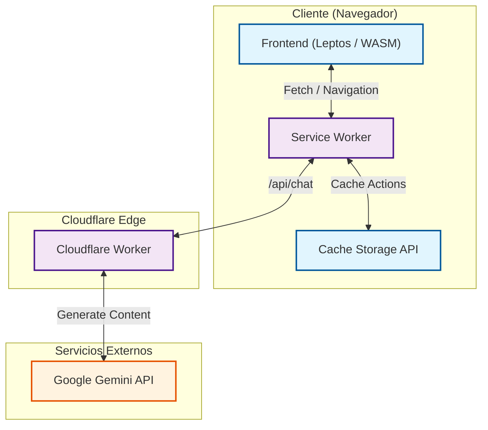
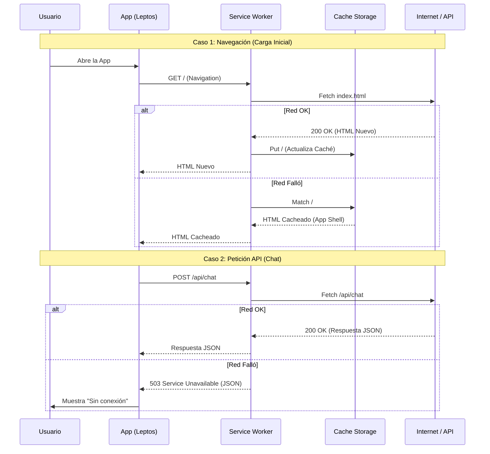

# IA | Inteligencia Animal

[](https://www.rust-lang.org/)
[](https://webassembly.org/)
[](https://workers.cloudflare.com/)
[](https://opensource.org/licenses/MIT)

Una aplicación web de chat conversacional donde los usuarios pueden interactuar con diferentes personalidades de IA,
cada una representada por un animal con características únicas. El proyecto utiliza Rust en todo el stack y está
diseñado para funcionar de manera eficiente en el edge, con capacidades offline avanzadas.

## Tabla de Contenidos

- [Características](#características)
- [Casos de Uso](#casos-de-uso)
- [Arquitectura](#arquitectura)
- [Service Worker](#service-worker)
- [Stack Tecnológico](#stack-tecnológico)
- [Instalación y Desarrollo](#instalación-y-desarrollo)
- [Features Futuras](#features-futuras)
- [Licencia](#licencia)

## Características

- **Conversaciones con IA**: Interactúa con múltiples personalidades de IA, cada una con un comportamiento y estilo de
  comunicación único
- **Offline-First**: Funciona sin conexión a internet gracias a un Service Worker optimizado
- **Baja Latencia**: Desplegado en Cloudflare Workers para respuestas rápidas desde ubicaciones cercanas al usuario
- **Progressive Web App**: Instalable en dispositivos móviles y de escritorio
- **Interfaz Reactiva**: Construida con Leptos para una experiencia de usuario fluida
- **Tipado Compartido**: El mismo código Rust define los tipos de datos en frontend y backend

## Casos de Uso

### Aprendizaje Interactivo

Los usuarios pueden aprender sobre diferentes perspectivas y estilos de pensamiento conversando con distintas
personalidades, cada una con su propia forma de razonar y comunicarse.

### Entretenimiento

Conversaciones divertidas y creativas con personajes únicos que ofrecen respuestas inesperadas y entretenidas.

### Demostración Técnica

Ejemplo práctico de cómo construir una aplicación web moderna completamente en Rust, desde el frontend hasta el backend,
con capacidades avanzadas de PWA.

## Arquitectura

La aplicación está diseñada con una arquitectura serverless que maximiza la velocidad de respuesta y minimiza los costos
operativos. El sistema se compone de tres capas principales:

1. **Cliente (Navegador)**: Una aplicación web compilada a WebAssembly que se ejecuta completamente en el navegador del
   usuario
2. **Edge Network**: Workers desplegados en la red global de Cloudflare para procesamiento cercano al usuario
3. **Servicios de IA**: Integración con Google Gemini para generar respuestas conversacionales

### Diagrama de Componentes



## Service Worker

El Service Worker personalizado garantiza que la aplicación funcione de manera confiable incluso sin conexión a
internet. Implementa estrategias de caché inteligentes que optimizan el rendimiento y permiten el uso offline completo
de la interfaz.

### Estrategias de Caché

El sistema utiliza diferentes estrategias de caché según el tipo de recurso, optimizando tanto el rendimiento como la
experiencia de usuario:

| Tipo de Recurso      | Estrategia             | Descripción                                                                        |
|:---------------------|:-----------------------|:-----------------------------------------------------------------------------------|
| **API (`/api/*`)**   | Network Only           | Siempre consulta el servidor para obtener respuestas actualizadas de la IA         |
| **Navegación**       | Network First          | Intenta cargar la versión más reciente; si falla, usa la versión en caché          |
| **Fuentes (.woff2)** | Cache First            | Las fuentes se sirven desde caché para acelerar la carga y evitar cambios visuales |
| **Assets Hashed**    | Cache First            | Archivos con hash en el nombre se cachean permanentemente por su inmutabilidad     |
| **Otros Assets**     | Stale-While-Revalidate | Sirve contenido cacheado inmediatamente mientras se actualiza en segundo plano     |

### Ciclo de Vida y Actualizaciones

El Service Worker gestiona su propio ciclo de vida para asegurar actualizaciones fluidas de la aplicación:

1. **Install**: Pre-cachea recursos críticos como el HTML principal y fuentes necesarias para el funcionamiento básico
2. **Activate**: Limpia versiones antiguas de caché para liberar espacio y asegurar que los usuarios usen la última
   versión
3. **Message Loop**: Escucha eventos de actualización y permite la descarga de recursos específicos bajo demanda

### Diagrama de Secuencia: Flujo de Petición



## Stack Tecnológico

- **Lenguaje**: Rust (compartido entre frontend y backend)
- **Frontend**: Leptos framework para WebAssembly
- **Backend**: Cloudflare Workers con workers-rs
- **Inteligencia Artificial**: Google Gemini 1.5 Flash
- **Build Tool**: Trunk
- **Estilos**: CSS nativo con variables personalizadas

## Instalación y Desarrollo

### Requisitos Previos

- Rust y Cargo instalados
- Trunk (`cargo install trunk`)
- Node.js y npm (para Wrangler CLI)

### Desarrollo

**Frontend:**

```bash
cd frontend
trunk serve
```

**Backend (Worker):**

```bash
cd worker
npx wrangler dev
```

## Features Futuras

### Modelo Local de IA

Capacidad de descargar y ejecutar un modelo de lenguaje directamente en el navegador para uso completamente offline.

**Concepto:**

- Descarga opcional de un modelo cuantizado (~1-2GB) que se almacena en disco usando Cache Storage
- El modelo se carga a RAM solo cuando está en uso y se libera al terminar
- Fallback inteligente: usa Gemini API cuando hay internet, modelo local cuando no hay conexión

**Tecnologías Consideradas:**

- WebLLM o Transformers.js para ejecutar modelos en el navegador
- WebGPU para aceleración por hardware
- Modelos candidatos: Phi-3, Gemma-2B, TinyLlama (cuantizados a 4-bit)

**Consideraciones:**

- Requiere hardware moderno: mínimo 8GB RAM, navegador con soporte WebGPU
- Respuestas más lentas (~500ms por token) comparado con la API cloud
- Calidad de respuestas inferior a Gemini 1.5, pero suficiente para conversaciones básicas
- Consumo elevado de batería en dispositivos móviles
- Verificación de espacio en disco y capacidades del dispositivo antes de descargar

**Beneficios:**

- Privacidad total: conversaciones procesadas localmente sin salir del dispositivo
- Funcionalidad completa offline, no solo interfaz
- Sin costos de API para usuarios que prefieran modelo local
- Degradación elegante de la experiencia según disponibilidad de recursos

## Licencia

Este proyecto está bajo la Licencia MIT. Consulta el archivo LICENSE para más detalles.

---

Desarrollado por cgutieco
